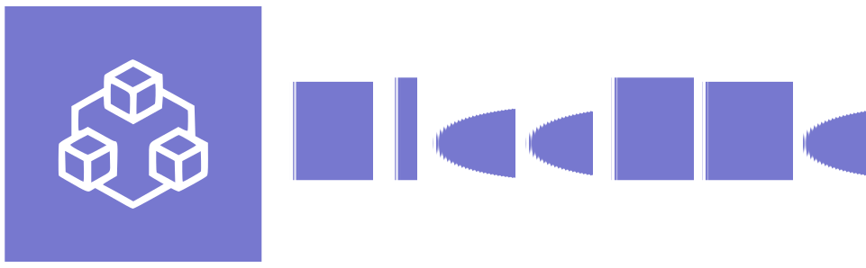
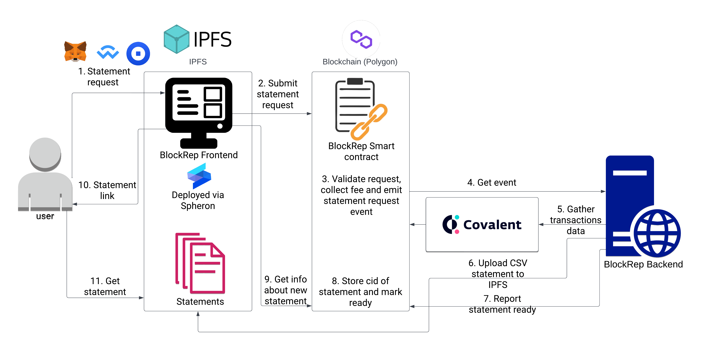

<p align="center"><a target="_blank" href="https://defi-statements-8hzeah.spheron.app/"></a></p>  
<p align="center">Application URL: https://defi-statements-8hzeah.spheron.app/</p>

##### Table of Contents
- [Description](#description)
    * [How to use](#how-to-use)
- [Architecture and used dependencies](#architecture-and-used-dependencies)
    * [Current state](#current-state)
    * [Potential further improvements](#potential-further-improvements)
- [Build and deploy](#build-and-deploy)
    * [Frontend](#frontend)
    * [Backend](#backend)
    * [Contracts](#contracts)

## Description
BlockRep (Blockchain Reporting) is a set of applications which allow you to collect transaction details and use it for more advanced analytics or prepare tax declaration reports.
### How to use
1. Go to the app https://defi-statements-8hzeah.spheron.app/
2. "Connect wallet"
3. "Statements"
4. Pick the date range and "Request statement"
5. Approve transaction in your wallet
6. Wait until transaction handled and new statement link appeared on the page
7. Use link to get your statement

## Architecture and used dependencies
### Current state
<p align="center"><div style="text-align: center;"></div></p>

* User can connect the wallet via [Metamask](https://metamask.io), [WalletConnect](https://www.walletconnect.com) or [CoinbaseWallet](https://www.coinbase.com/wallet)
* Frontend application deployed to [IPFS](https://ipfs.io/) via [Spheron](https://aqua.spheron.network/)
* Smart contract deployed and tested on [Polygon](https://polygon.technology/) [Mumbai](https://mumbai.polygonscan.com/address/0xb530731846ABCAa90976d8bd2b57999dD8dd74ef)
* On chain data for transaction details gathered via [Covalent](https://www.covalenthq.com/)
* Statement report uploading to [IPFS](https://ipfs.io/)

### Potential further improvements
* Enhanced transaction details. Such as USD price for ERC20.
* Multichain support (and not only EVM).
* Tax declarations ready to use per country.
* Analytics: PnL, market value etc.

## Build and deploy
### Frontend
All commands executed in `frontend` directory

Install dependencies:
```shell
yarn
```
Run local:
```shell
yarn dev
```

### Backend
All commands executed in `backend` directory

Requirements:
* `Java 17`
* `Docker`

1. Update config params in `src/main/java/org/example/Main.java`
```Java
public static final String COVALENT_API_KEY="covalent api key";
public static final String NODE_PROVIDER_URL="node provider url";
public static final String CONTRACT_ADDRESS="address of deployed contract";
public static final String APP_PRIVATE_KEY="private key of the app";
public static final int CHAIN_ID=80001; // id of the chain to work with
public static final String IPFS_USER="username for IPFS provider";
public static final String IPFS_PASSWORD="password for IPFS provider";
public static final String IPFS_UPLOAD_URL="IPFS upload url";
```

2. To run locally
```shell
# build the app
./gradlew clean build shadowJar
# build docker image
docker build -f Dockerfile -t 'block-rep' ./
# run the app via docker
docker run block-rep java -jar app.jar
```

### Contracts
All commands executed in `contract` directory
Install dependencies:
```shell
yarn
```
Run tests:
```shell
yarn test
```
Compile:
```shell
yarn build
```
Deploy
```shell
yarn deploy --network [localhost|polygonMumbai]
```
